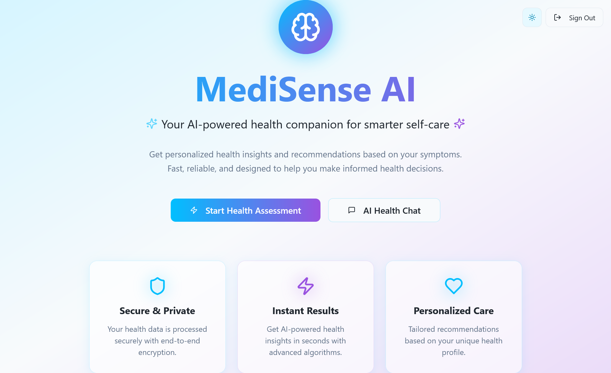
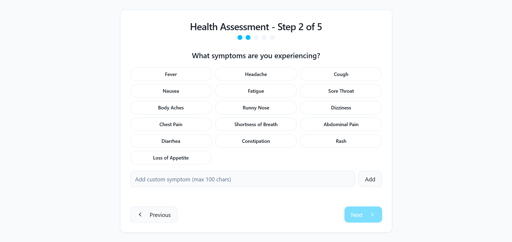
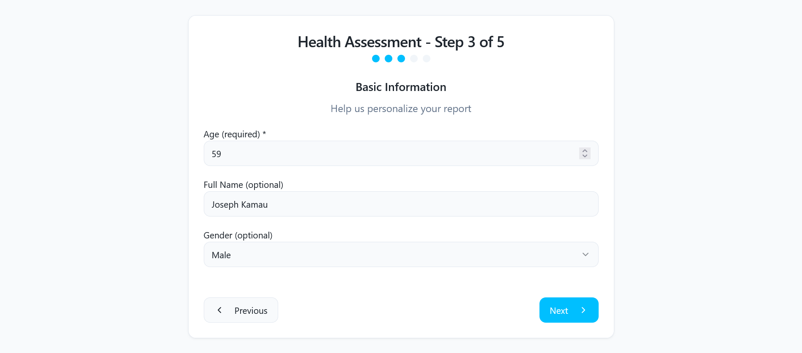
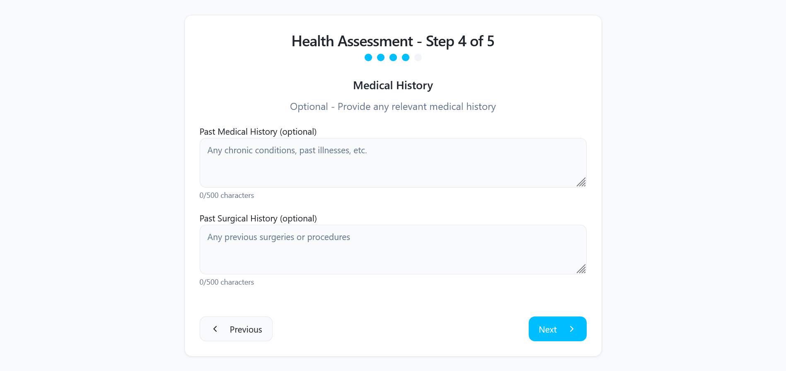
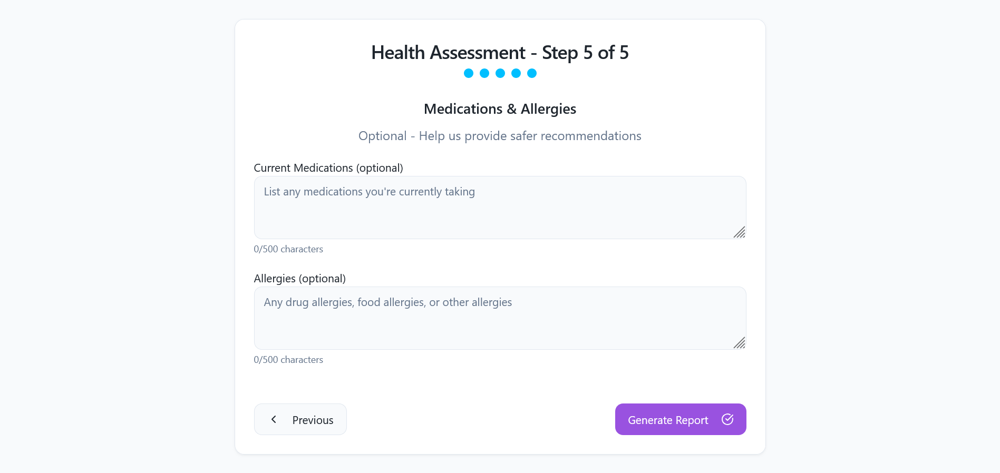

# Telivus-AI

Telivus-AI is an intelligent web application designed to help users manage and improve their self-care routines using artificial intelligence. The platform provides personalized recommendations, progress tracking, and insightful analytics to empower users on their wellness journey.

## 🚀 Demo

[Live Demo](https://your-demo-link.com) <!-- Replace with actual live link if available -->

---

## 📖 Project Overview

Telivus-AI leverages modern web technologies and AI to deliver a seamless self-care experience. Users can set goals, receive tailored suggestions, track habits, and visualize their progress. The application is designed for ease of use, accessibility, and privacy.

---

## 🛠️ Technology Stack

- **Frontend:** React, Vite, JavaScript/TypeScript, CSS3
- **Backend:** Node.js, Express (if applicable)
- **AI/ML:** OpenAI API or custom ML models (if applicable)
- **Database:** MongoDB / Firebase / PostgreSQL (specify as per your project)
- **Deployment:** Vercel / Netlify / Heroku (specify as per your project)
- **Other:** RESTful APIs, JWT Authentication, Chart.js (for analytics)

---

## ✨ Features

- Personalized self-care recommendations powered by AI
- Habit and goal tracking with reminders
- Progress analytics and visualizations
- User authentication and secure data storage
- Responsive and accessible UI
- Integration with third-party wellness APIs (optional)
- Dark mode support

---

## 📸 Screenshots










## 📝 Installation

1. **Clone the repository:**
   ```sh
   git clone https://github.com/yourusername/telivus-ai.git
   cd telivus-ai
   ```

2. **Install dependencies:**
   ```sh
   npm install
   ```

3. **Configure environment variables:**
   - Copy `.env.example` to `.env` and update with your API keys and configuration.

4. **Run the development server:**
   ```sh
   npm run dev
   ```

5. **Open in your browser:**
   - Visit [http://localhost:8080](http://localhost:8080) (or the port shown in your terminal).

---

## 💡 Usage

- Register or log in to your account.
- Set your self-care goals and preferences.
- Explore personalized recommendations.
- Track your daily habits and progress.
- View analytics and adjust your routines as needed.

---

## 🤝 Contributing

Contributions are welcome! Please follow these steps:

1. Fork the repository.
2. Create a new branch: `git checkout -b feature/your-feature-name`
3. Commit your changes: `git commit -m 'Add some feature'`
4. Push to the branch: `git push origin feature/your-feature-name`
5. Open a pull request.

Please read the [CONTRIBUTING.md](CONTRIBUTING.md) for more details.

---

## 📄 License

This project is licensed under the [MIT License](LICENSE).

---

## 👤 Author & Contact

**Joseph Kamau**  
Email: [iamjosephkamau@gmail.com](mailto:iamjosephkamau@gmail.com)  
Tel: +254725999285

---

## 🌐 Links

- [Live Demo](https://your-demo-link.com) <!-- Replace with actual live link -->
- [GitHub Repository](https://github.com/yourusername/telivus-ai)
