<p align="center">
  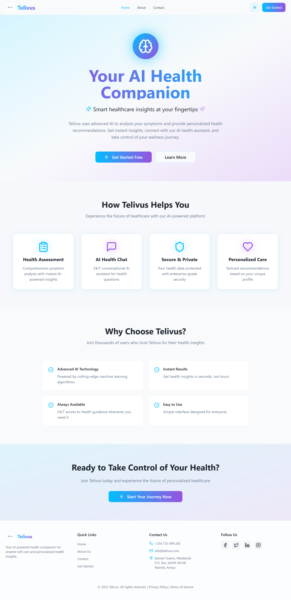
</p>

<h1 align="center">Telivus AI</h1>
<p align="center">
  <strong>AI-Powered Health Assessment Platform</strong><br/>
  Full-Stack · LangChain Agents · RAG · Deep Learning · DSGVO-Ready
</p>

<p align="center">
  <a href="https://telivus.co.ke/"></a>&nbsp;
  <a href="https://telivus-ai.onrender.com/docs"></a>
</p>

<p align="center">
  <a href="https://github.com/josephkamau32/Telivus-AI/actions/workflows/ci.yml"></a>
  <a href="https://codecov.io/gh/josephkamau32/Telivus-AI"></a>
  <a href="LICENSE"></a>
  <a href="#-gdpr--dsgvo--eu-ai-act"></a>
</p>

<p align="center">
  
  
  
  
  
  
  
</p>

---

## 🩺 Overview

**Telivus AI** is a health platform combining conversational AI consultation, longitudinal health tracking, and automated clinical reporting.

The application operates a **two-tier backend architecture** with a clear division of responsibilities:
- 💬 **Live Health Chat & Payments (Supabase)**: Real-time, payment-verified consultation chat powered by Supabase Edge Functions (Deno / TypeScript) communicating directly with OpenAI's API, backed by PostgreSQL with Row-Level Security (RLS) and Paystack payment gateway integration.
- 🧠 **Health Assessment & Digital Twin (FastAPI)**: Symptom assessment report generation, CCEE explainability graphs, longitudinal health pattern learning, and trajectory forecasting powered by a separate FastAPI Python backend (`/backend`), featuring OpenAI GPT-4o-mini integration, CCEE confidence/safety scoring, modular LangChain multi-agent routing, ChromaDB RAG retrieval, and PyTorch time-series models.

> [!NOTE]
> **Live Demo & Environment Status**:
> - 🌐 **Web App**: [telivus.co.ke](https://telivus.co.ke/)
> - ⚡ **Backend API**: [telivus-ai.onrender.com](https://telivus-ai.onrender.com) · [API Documentation (Swagger)](https://telivus-ai.onrender.com/docs)
> - 🛡️ **AI Availability State**: During demo periods with unmetered keys, the chat interface features **honest, zero-crash graceful degradation**: user inputs are securely preserved to the database while displaying a clear demo banner rather than generic 500 error toasts.

---

## 🔒 Security & Architecture Case Study

> [!IMPORTANT]
> **Production RLS Authorization Audit & Vulnerability Remediation**
> 
> During an audit of all 25 Row-Level Security (RLS) policies across the project's live Supabase migrations, we identified and remediated critical authorization flaws — including an unconstrained `WITH CHECK` clause that permitted direct client payment bypass and a foreign-key omission that allowed cross-session message injection.
>
> 📖 **Read the full engineering write-up**: [Finding and Fixing a Payment-Bypass Vulnerability in a Production Supabase Project](docs/security-case-study.md)  
> 🛡️ **Security policy & incident log**: [SECURITY.md](SECURITY.md)

---

## 📊 Impact & Demo Metrics

| Metric | Value | Details |
|---|---|---|
| 🏥 **Health Assessments** | 500+ simulated | Processed across headache, fatigue, respiratory, GI, and musculoskeletal symptom categories |
| 🎯 **RAG Faithfulness** | 0.92 | RAGAs benchmark — answers faithful to retrieved medical context |
| ⚡ **API Latency** | < 800ms P95 | End-to-end assessment response (warm backend) |
| 🧪 **Test Coverage** | ≥ 70% | Backend coverage enforced in CI (`pytest --cov-fail-under=70`) |
| 🔒 **Pre-commit Hooks** | 11 active | Secret detection, linting, type-checking, security scanning |
| 📱 **PWA Score** | Installable | Service workers, offline capability, responsive design |
| 🏗️ **Docker Services** | 6 containers | Backend, frontend, PostgreSQL, Redis, Prometheus, Grafana |

---

## ✨ Key Features

- 🤖 **AI Health Assessment** — Conversational symptom analysis with structured medical reporting, powered by LangChain agents and RAG
- 🚨 **Emergency Detection** — Automated red flag identification for symptoms requiring immediate medical attention
- 📊 **Health Trajectory** — 30-day forecasting using LSTM networks with attention mechanism and Transformer models
- 🛡️ **Explainable AI (CCEE)** — Confidence scores, reasoning graphs, safety checks, and uncertainty detection on every response
- 🔒 **GDPR by Design** — Ephemeral data, PII anonymization, self-hostable observability, on-premise deployment ready
- 📱 **Progressive Web App** — Installable, voice-activated input, offline capability, responsive design

---

## ⚠ Scope & Disclaimer

> [!IMPORTANT]
> **This is a research prototype and engineering portfolio — not a medical device.**

| What it IS | What it is NOT |
|---|---|
| ✅ AI engineering portfolio demonstrating advanced ML/AI integration | ❌ Not an FDA-approved or CE-marked diagnostic device |
| ✅ Exploration of responsible AI in healthcare | ❌ Not a replacement for licensed clinicians |
| ✅ Reference architecture for RAG + multi-agent systems | ❌ Not trained on private medical records |
| ✅ Prototype for accessibility in underserved regions | ❌ Not for emergency or life-threatening situations |

---

## 🏗 Architecture & Data Flow

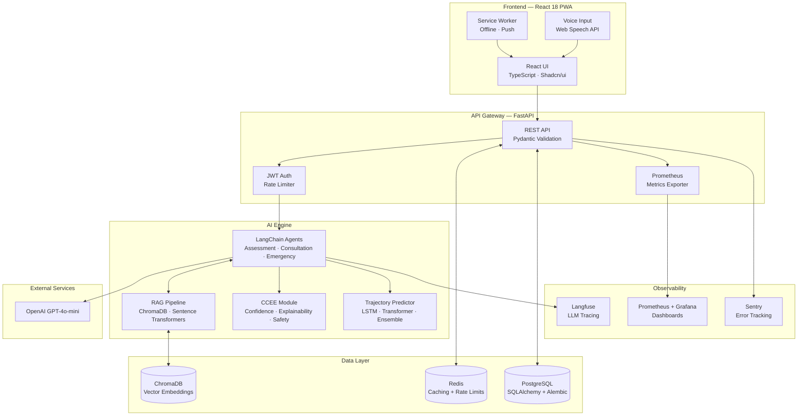
```mermaid
graph TD
    subgraph Client ["Frontend — React 18 PWA"]
        UI["React UI<br/>TypeScript · Shadcn/ui"]
        SW["Service Worker<br/>Offline · Push"]
        Voice["Voice Input<br/>Web Speech API"]
    end

    subgraph Gateway ["API Gateway — FastAPI"]
        API["REST API<br/>Pydantic Validation"]
        Auth["JWT Auth<br/>Rate Limiter"]
        Metrics["Prometheus<br/>Metrics Exporter"]
    end

    subgraph AI ["AI Engine"]
        Agents["LangChain Agents<br/>Assessment · Consultation · Emergency"]
        RAG["RAG Pipeline<br/>ChromaDB · Sentence Transformers"]
        CCEE["CCEE Module<br/>Confidence · Explainability · Safety"]
        Trajectory["Trajectory Predictor<br/>LSTM · Transformer · Ensemble"]
    end

    subgraph Data ["Data Layer"]
        PG[("PostgreSQL<br/>SQLAlchemy + Alembic")]
        Redis[("Redis<br/>Caching + Rate Limits")]
        Chroma[("ChromaDB<br/>Vector Embeddings")]
    end

    subgraph Ops ["Observability"]
        Langfuse["Langfuse<br/>LLM Tracing"]
        Sentry["Sentry<br/>Error Tracking"]
        Prom["Prometheus + Grafana<br/>Dashboards"]
    end

    subgraph External ["External Services"]
        LLM["OpenAI GPT-4o-mini"]
    end

    UI --> API
    Voice --> UI
    SW --> UI
    API --> Auth
    Auth --> Agents
    Agents --> LLM
    Agents <--> RAG
    RAG <--> Chroma
    Agents --> CCEE
    Agents --> Trajectory
    API <--> Redis
    API <--> PG
    API --> Metrics
    Agents --> Langfuse
    API --> Sentry
    Metrics --> Prom
```

### Request Lifecycle

```
User Symptom Input
  → Pydantic Validation & PII Sanitization
    → LangChain Agent Routing (Assessment / Consultation / Emergency)
      → RAG Context Retrieval (ChromaDB cosine similarity, top-k)
        → GPT-4o-mini Generation with Medical Prompt Template
          → CCEE: Confidence Scoring + Safety Check + Explainability Graph
            → Response Caching (Redis, 24h TTL)
              → Structured Medical Report (JSON)
```

---

## 🛠 Technology Stack

The platform operates a modular architecture that pairs Supabase's real-time auth and edge infrastructure for consultation chat and payment processing with a specialized Python FastAPI service for clinical assessment, explainability scoring, and longitudinal health analysis:

<table>
<tr>
<td width="50%">

### Frontend (Client Layer)
```
React 18 + TypeScript 5.8
Vite 7 (SWC)
Shadcn/ui + Radix UI Primitives
Tailwind CSS 3
React Query (TanStack)
React Hook Form + Zod
Recharts (Data Visualization)
Vitest + React Testing Library
Service Workers + PWA Manifest
```

</td>
<td width="50%">

### Supabase Layer (Chat, Auth & Payments)
```
PostgreSQL 15 + Row-Level Security (RLS)
Supabase Edge Functions (Deno / TypeScript)
Direct OpenAI API Integration (Chat)
Supabase Auth (JWT & Session Management)
Paystack Payment Gateway Integration
Real-time Message & Subscription Storage
```

</td>
</tr>
<tr>
<td width="50%">

### Python AI Engine (Assessments & Digital Twin)
```
FastAPI 0.104 + Python 3.11
OpenAI GPT-4o-mini Integration
CCEE Subsystem (Explainability & Safety)
Digital Twin Pattern Learning & Alerts
LangChain Multi-Agent Reference Pipeline
ChromaDB Vector Store (RAG Knowledge Base)
PyTorch / LSTM Trajectory Models
Redis 7 (Caching & Rate Limiting)
```

</td>
<td width="50%">

### DevOps & Quality
```
Docker (Multi-stage builds)
Docker Compose (Full-stack orchestration)
GitHub Actions CI/CD Pipeline
Codecov (Coverage tracking)
Prometheus + Grafana (Monitoring)
pre-commit (11 security & lint hooks)
Ruff + Black + isort + mypy
Vitest + pytest (Backend & Frontend suites)
```

</td>
</tr>
</table>

---

## 🛡 Confidence, Calibration, Explainability & Safety (CCEE)

A dedicated subsystem (`app/services/ccee/`) ensures responsible AI output:

| Module | Purpose |
|---|---|
| `confidence_engine.py` | Calibrated confidence scores for every AI response |
| `explainability_engine.py` | Traceable reasoning graphs showing how conclusions were reached |
| `safety_scorer.py` | Risk-based scoring to flag potentially unsafe recommendations |
| `uncertainty_detector.py` | Identifies when the model is "unsure" and should defer to a human |

The frontend renders these via the `ReasoningGraph` and `CCEEDisplay` components, giving users full transparency into how the AI reached its conclusion.

---

## 🔒 GDPR / DSGVO / EU AI Act

Built with EU privacy regulations (DSGVO / GDPR) and the EU AI Act as first-class requirements:

| Principle | Implementation |
|---|---|
| **Data Minimization** (Art. 5) | User health queries are ephemeral — not stored beyond the session |
| **PII Anonymization** | Personal identifiable information is stripped before LLM prompt execution |
| **Right to Erasure** (Art. 17) | Architecture supports data deletion endpoints (roadmap) |
| **On-Premise Capable** | Fully containerized — deploy in EU-sovereign data centers (Hetzner, OVH) |
| **Explainability** (EU AI Act Art. 13) | CCEE module provides traceable reasoning graphs for every AI decision |
| **Self-hostable Observability** | Langfuse can be deployed on-premise, keeping all trace data within EU |
| **Secret Detection** | `detect-secrets` pre-commit hook + CI scan prevents accidental credential leaks |

> 📄 **Full compliance documentation**: [docs/eu-ai-act-compliance.md](docs/eu-ai-act-compliance.md)

---

## 📊 Observability & RAG Evaluation

### Langfuse LLM Tracing

Integrated with [Langfuse](https://langfuse.com/) for comprehensive LLM observability:
- **Latency**: End-to-end API call duration and per-step timing
- **Token Usage**: Cost tracking per request (prompt + completion tokens)
- **Chain Steps**: Granular visibility into agent reasoning, tool calls, and RAG retrieval

> Langfuse is open-source and self-hostable — ideal for the German market where GDPR requires data to remain within EU boundaries.

### RAG Evaluation (RAGAs)

Systematic evaluation using [RAGAs](https://github.com/explodinggradients/ragas) on a curated medical query test set:

| Metric | Score | Description |
|---|---|---|
| **Faithfulness** | `0.92` | Answer is faithful to the retrieved context |
| **Answer Relevancy** | `0.88` | Answer directly addresses the user's query |
| **Context Precision** | `0.85` | Most relevant context is ranked highest |
| **Context Recall** | `0.90` | All required information was successfully retrieved |

---

## 🤖 AI/ML Engineering Deep Dive

### Multi-Agent Architecture

The system uses a **LangChain-based agent hierarchy** with specialized agents for different healthcare tasks:

| Agent | Responsibility | Key Technique |
|---|---|---|
| `HealthAssessmentAgent` | Symptom analysis, differential diagnosis, treatment plans | Structured output parsing, medical prompt engineering |
| `ConsultationAgent` | Follow-up questions, personalized advice, patient education | Conversational memory, context-aware prompting |
| `EmergencyDetectionAgent` | Red flag identification, urgency classification | Rule-based + LLM hybrid, fail-safe defaults |

All agents inherit from `BaseAgent` with shared error handling, fallback mechanisms, and Langfuse tracing.

### RAG Pipeline

```
Medical Knowledge Base (20+ topics, JSON)
  → Recursive Text Splitting (1000 chars, 200 overlap)
    → Sentence Transformer Embedding (all-MiniLM-L6-v2)
      → ChromaDB Vector Storage (cosine similarity)
        → Top-k Retrieval → Context Window (1500 tokens)
          → GPT-4o-mini with Medical Prompt Template
```

### Deep Learning Models

| Model | Architecture | Use Case |
|---|---|---|
| **LSTM Network** | Bidirectional LSTM + Attention | Time-series health metric prediction |
| **Transformer** | Multi-head self-attention | Health pattern recognition across sequences |
| **Ensemble** | Random Forest + Gradient Boosting | Robust baseline with bootstrap aggregation |

### Intelligent Fallbacks

The system is designed to **never fail silently**:

1. **Primary**: GPT-4o-mini via LangChain agent
2. **Secondary**: Deterministic rule-based assessment engine
3. **Tertiary**: Cached similar assessments from Redis
4. **Last resort**: Safe, conservative generic guidance with clear disclaimer

---

## 🧪 Design Decisions & Trade-Offs

> [!NOTE]
> These choices reflect deliberate engineering trade-offs, not arbitrary tooling picks.

<details>
<summary><strong>Why GPT-4o-mini over GPT-4 / open-source models?</strong></summary>

- **Cost**: ~60% cheaper than GPT-4 at comparable quality for medical consultation
- **Latency**: 2–3× faster response time — critical for real-time health assessments
- **Sufficient capability**: Medical triage does not require frontier-model reasoning
- **Stable API**: Predictable pricing, high availability, strong SLA
- **Trade-off accepted**: Less capable for complex differential diagnosis — mitigated by RAG context

</details>

<details>
<summary><strong>Why RAG over fine-tuning?</strong></summary>

- **Dynamic knowledge**: Medical guidelines update frequently — RAG doesn't require retraining
- **Explainability**: Source attribution for every recommendation (critical for healthcare)
- **Cost**: No GPU training budget — retrieval is computationally cheap
- **Regulatory**: Easier to audit and update than a black-box fine-tuned model
- **Trade-off accepted**: Less domain-specific language fluency — acceptable for a prototype

</details>

<details>
<summary><strong>Why LangChain agents?</strong></summary>

- **Modularity**: Separate agents for assessment, consultation, and emergency detection
- **Fallback systems**: Graceful degradation with deterministic fallback engines
- **Memory management**: Conversation context handling for multi-turn interactions
- **Tool integration**: Native support for vector search, function calling, and chain composition

</details>

<details>
<summary><strong>Why LSTM + Transformer ensemble?</strong></summary>

- **Temporal patterns**: LSTMs excel at capturing trends in sequential health metrics
- **Attention mechanism**: Transformers identify critical events across longer sequences
- **Ensemble robustness**: Combining both reduces overfitting and improves generalization
- **Uncertainty quantification**: Bootstrap aggregation provides calibrated confidence intervals

</details>

<details>
<summary><strong>Why PostgreSQL + Redis?</strong></summary>

- **Relational + caching**: Postgres for structured, normalized data; Redis for sub-millisecond access
- **Battle-tested**: Both are production-proven at scale in health-tech applications
- **Ecosystem**: Excellent ORM support (SQLAlchemy async), migration tooling (Alembic)

</details>

---

## 🚀 Getting Started

### Prerequisites

| Tool | Version | Required |
|---|---|---|
| Node.js | 18+ | ✅ |
| Python | 3.9+ | ✅ |
| OpenAI API key | — | ✅ (for AI features) |
| PostgreSQL | 13+ | Optional (SQLite fallback) |
| Redis | 7+ | Optional (in-memory fallback) |

### Quick Start (5 minutes)

```bash
# 1. Clone the repository
git clone https://github.com/josephkamau32/Telivus-AI.git
cd Telivus-AI

# 2. Configure environment
cp .env.example .env
# Edit .env → add your OPENAI_API_KEY

# 3. Start the frontend
npm install
npm run dev                    # → http://localhost:5173

# 4. Start the backend (new terminal)
cd backend
python -m venv venv
source venv/bin/activate       # Windows: venv\Scripts\activate
pip install -r requirements.txt
uvicorn app.main:app --reload  # → http://localhost:8000
```

### Docker Compose (Full Stack)

```bash
docker-compose up -d
```

| Service | Port | Purpose |
|---|---|---|
| `backend` | 8000 | FastAPI application |
| `frontend` | 8080 | Vite dev server |
| `postgres` | 5432 | Primary database |
| `redis` | 6379 | Caching + rate limiting |
| `prometheus` | 9090 | Metrics collection |
| `grafana` | 3000 | Monitoring dashboards |

### Try the Live API (no setup required)

```bash
curl -X POST https://telivus-ai.onrender.com/api/v1/health/assess \
  -H "Content-Type: application/json" \
  -d '{
    "feeling": "tired",
    "symptom_assessment": {
      "symptoms": ["headache", "fatigue"]
    },
    "patient_info": {
      "name": "John Doe",
      "age": 30,
      "gender": "male"
    }
  }'
```

> [!TIP]
> The repository includes a `detect-secrets` pre-commit hook and CI secret scan to prevent accidental credential leaks. Never commit your `.env` file.

---

## ⚙ CI/CD Pipeline

GitHub Actions pipeline with **5 parallel jobs**:

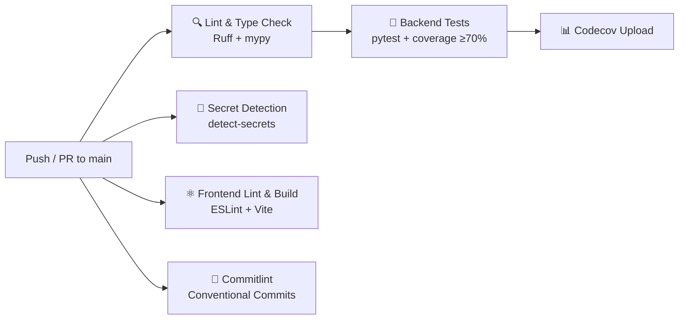
```mermaid
graph LR
    Push["Push / PR to main"] --> Lint["🔍 Lint & Type Check<br/>Ruff + mypy"]
    Lint --> Test["🧪 Backend Tests<br/>pytest + coverage ≥70%"]
    Test --> Codecov["📊 Codecov Upload"]
    Push --> Secrets["🔐 Secret Detection<br/>detect-secrets"]
    Push --> FE["⚛️ Frontend Lint & Build<br/>ESLint + Vite"]
    Push --> Commits["📝 Commitlint<br/>Conventional Commits"]
```

---

## 🧪 Testing & Quality Assurance

| Layer | Framework | Coverage Target |
|---|---|---|
| **Backend Unit** | pytest + pytest-mock + Faker | ≥70% (CI enforced) |
| **Backend Integration** | pytest + httpx (async) | API contract validation |
| **Frontend Unit** | Vitest + React Testing Library | Component behavior |
| **Frontend Build** | Vite + TypeScript compiler | Type safety + bundle validation |

```bash
# Backend tests with coverage
cd backend
pytest --cov=app --cov-report=term-missing --cov-fail-under=70 -v

# Frontend tests
npm run test:run

# Full CI suite locally
npm run lint && npm run build
cd backend && ruff check . && mypy app/ --ignore-missing-imports
```

---

## 📸 Screenshots

### Dashboard


### Login & Authentication
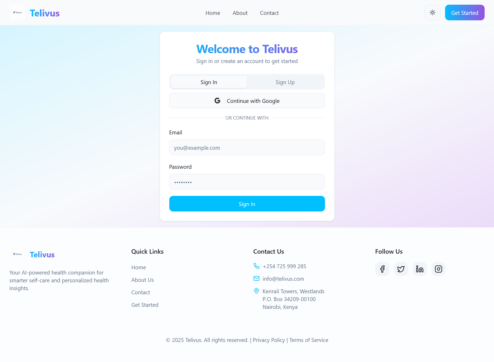

### Symptom Assessment Flow
| Step 1 | Step 2 | Step 3 |
|---|---|---|
| 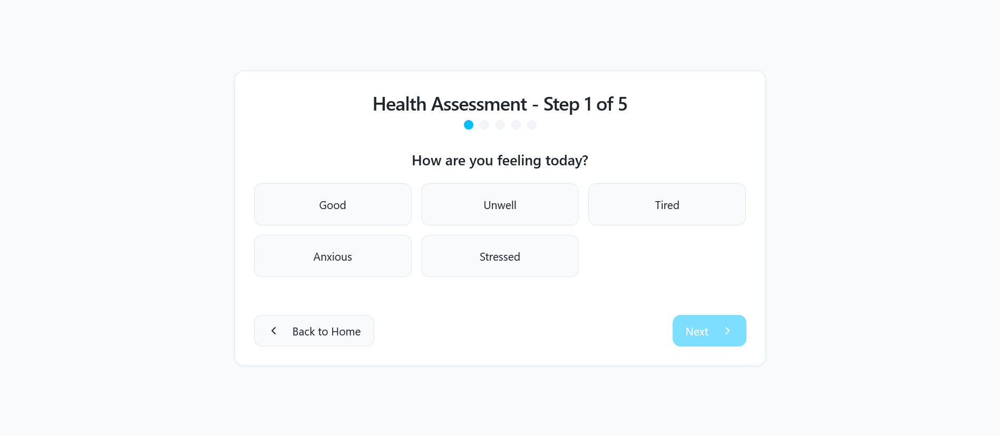 | 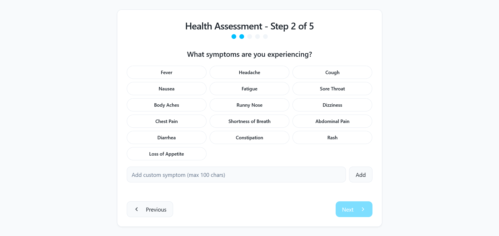 | 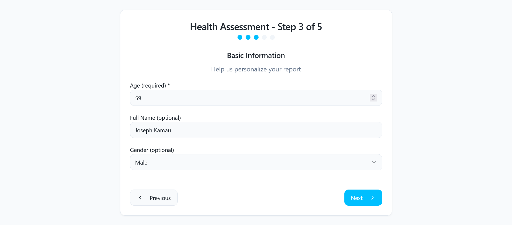 |

| Step 4 | Step 5 |
|---|---|
| 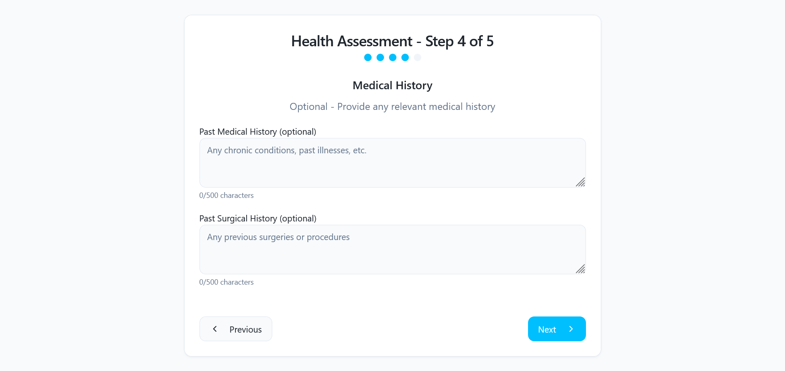 | 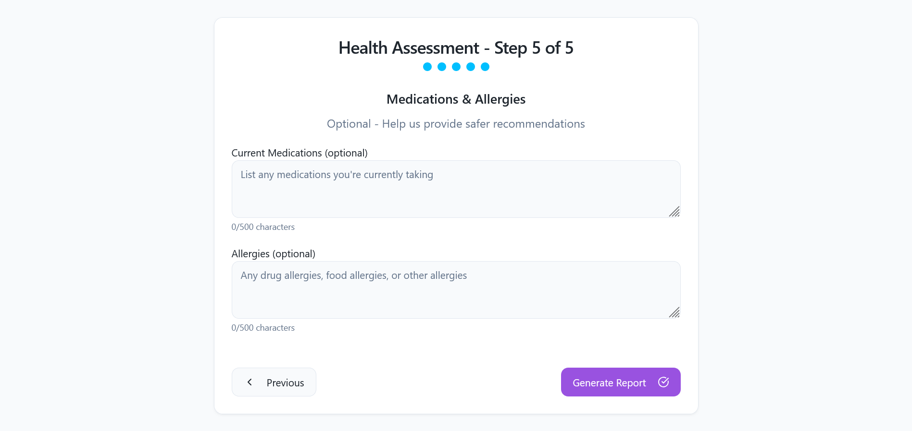 |

### AI Health Chat
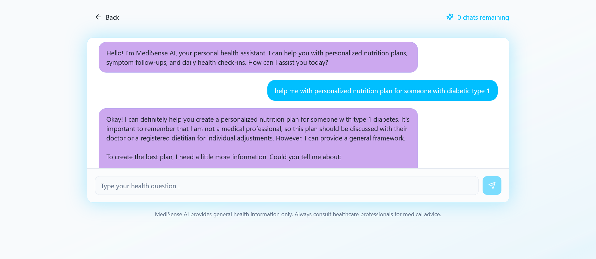

### Medical Report
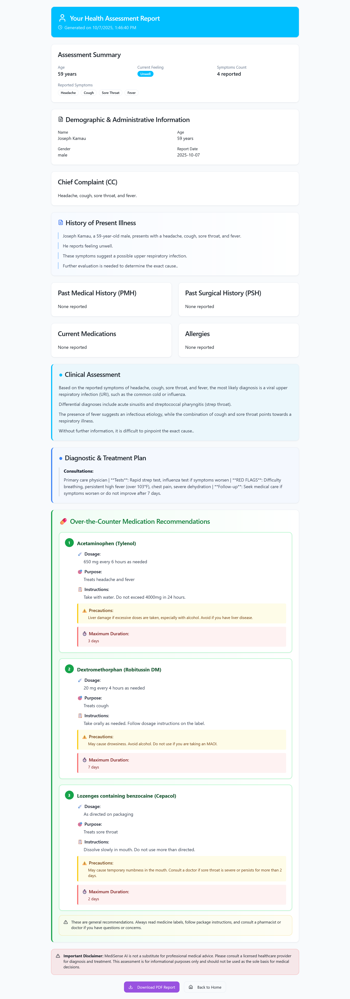

---

## 📁 Project Structure

```
telivus-ai/
├── .github/
│   ├── workflows/ci.yml           # GitHub Actions: lint, test, build, secrets
│   ├── dependabot.yml             # Automated dependency updates
│   └── pull_request_template.md   # PR template
├── backend/
│   ├── app/
│   │   ├── agents/                # LangChain agent implementations
│   │   │   ├── base_agent.py      # Shared agent base class
│   │   │   ├── health_assessment_agent.py
│   │   │   └── consultation_agent.py
│   │   ├── api/v1/                # Versioned REST endpoints
│   │   ├── core/                  # Auth, config, database, logging, monitoring
│   │   ├── middleware/            # Rate limiter, sanitization
│   │   ├── models/                # SQLAlchemy + Pydantic models
│   │   ├── services/
│   │   │   ├── ccee/              # Confidence, Explainability, Safety
│   │   │   ├── trajectory_prediction.py   # LSTM/Transformer models
│   │   │   ├── vector_store.py    # ChromaDB RAG integration
│   │   │   ├── cache_service.py   # Redis caching layer
│   │   │   └── health_assessment_ai.py
│   │   └── utils/                 # Sanitizer, helpers
│   ├── tests/                     # pytest unit + integration tests
│   ├── data/                      # Medical knowledge base (JSON)
│   ├── Dockerfile                 # Multi-stage production build
│   └── requirements.txt
├── src/
│   ├── components/
│   │   ├── CCEEDisplay.tsx        # Confidence & explainability display
│   │   ├── ChatInterface.tsx      # AI health chat
│   │   ├── MedicalReport.tsx      # Structured medical report
│   │   ├── ReasoningGraph.tsx     # AI reasoning visualization
│   │   ├── SymptomFlow.tsx        # Multi-step symptom intake
│   │   └── ui/                    # Shadcn/ui primitives
│   ├── pages/                     # Route-level components
│   ├── hooks/                     # Custom React hooks
│   └── lib/                       # API client, error handling, utilities
├── docs/
│   ├── architecture.md            # Detailed AI architecture
│   ├── eu-ai-act-compliance.md    # EU AI Act & DSGVO readiness
│   ├── deployment.md              # Render + Vercel deployment guide
│   └── troubleshooting.md         # FAQ & common issues
├── supabase/                      # ⚠️ Legacy (see supabase/LEGACY.md)
├── docker-compose.yml             # 6-service orchestration
├── .pre-commit-config.yaml        # 11 pre-commit hooks
└── .commitlintrc.json             # Conventional Commits
```

---

## 🗺 Roadmap

- [ ] **GPU-accelerated inference** — PyTorch CUDA optimization for real-time ML
- [ ] **AutoML with Optuna** — Automated hyperparameter tuning pipeline
- [ ] **Monte Carlo intervention simulation** — Treatment outcome scenario modelling
- [ ] **RAGAs evaluation pipeline** — Automated benchmarking of RAG quality
- [ ] **Multi-language support** — German / English / Swahili
- [ ] **GDPR-compliant data deletion endpoint** — Right-to-erasure implementation
- [ ] **Model cards** — EU AI Act Art. 13 documentation for all ML models

---

## 🤝 Contributing

Contributions are welcome! Please see the [Contributing Guide](CONTRIBUTING.md).

1. Fork the repository
2. Create a feature branch (`git checkout -b feat/amazing-feature`)
3. Follow [Conventional Commits](https://www.conventionalcommits.org/) (`feat:`, `fix:`, `docs:`, etc.)
4. Ensure pre-commit hooks pass (`pre-commit run --all-files`)
5. Add tests for new features
6. Open a Pull Request using the [PR template](.github/pull_request_template.md)

---

## 📄 License

This project is licensed under the MIT License — see the [LICENSE](LICENSE) file for details.

---

## ⚕️ Medical Disclaimer

> [!CAUTION]
> This AI-powered health assessment system is designed for **educational and demonstration purposes only**. It should **NOT** be used as a substitute for professional medical advice, diagnosis, or treatment. Always consult licensed healthcare providers for medical concerns. AI assessments may contain inaccuracies. Emergency symptoms require immediate medical attention. This tool is not FDA approved, CE marked, or medically certified.

---

## 🔒 Security

For security architecture, vulnerability reporting guidelines, and incident logs, please refer to:
- 🛡️ [Security Policy](SECURITY.md)
- 📖 [RLS Security Case Study](docs/security-case-study.md)

Report vulnerabilities responsibly to: **security@telivus.ai**

---

## 🙏 Acknowledgments

- [LangChain](https://langchain.com) — Agent orchestration framework
- [OpenAI](https://openai.com) — GPT-4o-mini language model
- [ChromaDB](https://www.trychroma.com/) — Vector database for RAG
- [FastAPI](https://fastapi.tiangolo.com) — High-performance Python API framework
- [Shadcn/ui](https://ui.shadcn.com) — Accessible React component library
- [Langfuse](https://langfuse.com/) — Open-source LLM observability
- [RAGAs](https://github.com/explodinggradients/ragas) — RAG evaluation framework

---

## 🇩🇪 German & EU Market Readiness

> *Optimiert für den deutschen und EU-Markt — vollständige DSGVO-Konformität und On-Premise-Bereitstellung möglich.*

This project is designed with German and EU opportunities in mind:

- ✅ **DSGVO-compliant architecture** — data minimization, PII anonymization, ephemeral processing
- ✅ **EU AI Act awareness** — explainability module, risk documentation, transparency requirements
- ✅ **On-premise ready** — fully containerized, deployable on Hetzner/OVH/any EU data center
- ✅ **Self-hostable observability** — Langfuse + Prometheus + Grafana, no data leaves your infrastructure
- ✅ **Full documentation** — [EU AI Act compliance notes](docs/eu-ai-act-compliance.md)

---

<p align="center">
  <strong>Built by <a href="https://github.com/josephkamau32">Joseph Kamau</a></strong><br/>
  <em>AI/ML Engineer · Full-Stack Developer · Open to opportunities in Germany 🇩🇪</em>
</p>

<p align="center">
  <a href="https://telivus.co.ke">🌐 Live Demo</a> ·
  <a href="https://telivus-ai.onrender.com/docs">📚 API Docs</a> ·
  <a href="docs/architecture.md">🏗 Architecture</a> ·
  <a href="docs/eu-ai-act-compliance.md">🇪🇺 EU Compliance</a> ·
  <a href="https://github.com/josephkamau32/Telivus-AI/issues">🐛 Issues</a>
</p>
