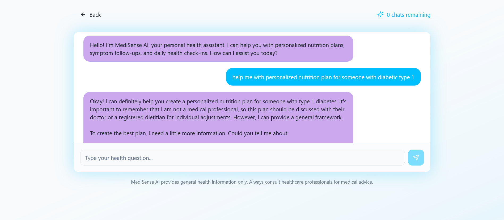

# Telivus AI - AI-Powered Health Assessment Platform

[](https://telivus.co.ke/) [](LICENSE)

Telivus AI is an intelligent health assessment platform that leverages artificial intelligence to analyze user symptoms, provide personalized health insights, and generate comprehensive medical reports. Built as a Progressive Web App (PWA), it offers a seamless experience across devices with features like voice input, multi-language support, and offline capabilities.

## 🚀 Features

- **Symptom Assessment Flow**: Interactive step-by-step symptom analysis with intelligent questioning
- **AI-Powered Chat**: Real-time health consultations with AI for personalized advice
- **Medical Report Generation**: Automated generation of detailed health reports in PDF format
- **Multi-Language Support**: Available in multiple languages for global accessibility
- **Voice Input**: Hands-free symptom reporting using voice recognition
- **Progressive Web App**: Installable on mobile devices with offline functionality
- **Secure Authentication**: User authentication and data privacy protection
- **Responsive Design**: Optimized for desktop, tablet, and mobile devices
- **Dark/Light Theme**: Customizable interface themes

## 🛠️ Tech Stack

- **Frontend**: React 18, TypeScript, Vite
- **UI Framework**: Tailwind CSS, Shadcn/ui, Radix UI
- **Backend**: Supabase (Database, Authentication, Edge Functions)
- **State Management**: React Query (TanStack)
- **Forms**: React Hook Form with Zod validation
- **Charts**: Recharts
- **PDF Generation**: jsPDF
- **Internationalization**: Custom i18n implementation
- **PWA**: Service Workers, Web App Manifest

## 📦 Installation

### Prerequisites

- Node.js (v18 or higher)
- npm or yarn
- Supabase account

### Setup

1. **Clone the repository**
   ```bash
   git clone https://github.com/your-username/telivus-ai.git
   cd telivus-ai
   ```

2. **Install dependencies**
   ```bash
   npm install
   ```

3. **Environment Setup**
   ```bash
   cp env.example .env.local
   ```
   Fill in your Supabase credentials and other environment variables.

4. **Supabase Setup**
   - Create a new Supabase project
   - Run the migrations in the `supabase/migrations` directory
   - Deploy the edge functions in `supabase/functions`

5. **Start the development server**
   ```bash
   npm run dev
   ```

6. **Build for production**
   ```bash
   npm run build
   npm run preview
   ```

## 📱 Usage

1. **Access the Application**: Open your browser and navigate to `http://localhost:5173`

2. **User Registration/Login**: Create an account or log in with existing credentials

3. **Symptom Assessment**: Follow the guided symptom assessment flow to input your health information

4. **AI Consultation**: Chat with the AI for additional health insights and recommendations

5. **Medical Report**: Generate and download your personalized medical report

## 📸 Screenshots

### Login Page


### Dashboard


### Symptom Assessment Flow


### AI Health Chat


### Medical Report


## 🏗️ Project Structure

```
telivus-ai/
├── public/                 # Static assets and PWA files
├── src/
│   ├── components/         # Reusable UI components
│   ├── pages/             # Page components
│   ├── contexts/          # React contexts
│   ├── hooks/             # Custom React hooks
│   ├── integrations/      # External service integrations
│   ├── lib/               # Utility functions and configurations
│   └── assets/            # Images and icons
├── supabase/
│   ├── functions/         # Edge functions
│   └── migrations/        # Database migrations
├── screenshots/           # Application screenshots
└── tests/                 # Test files
```

## 🤝 Contributing

We welcome contributions! Please follow these steps:

1. Fork the repository
2. Create a feature branch (`git checkout -b feature/amazing-feature`)
3. Commit your changes (`git commit -m 'Add amazing feature'`)
4. Push to the branch (`git push origin feature/amazing-feature`)
5. Open a Pull Request

### Development Guidelines

- Follow TypeScript best practices
- Use ESLint for code linting
- Write tests for new features
- Update documentation as needed
- Ensure responsive design across devices

## 📄 License

This project is licensed under the MIT License - see the [LICENSE](LICENSE) file for details.

## 🔒 Security

For security concerns, please refer to our [Security Policy](SECURITY.md).

## 📞 Support

If you have any questions or need support:

- Open an issue on GitHub
- Check the documentation
- Contact the maintainers

## 🙏 Acknowledgments

- Built with [Supabase](https://supabase.com) for backend services
- UI components from [Shadcn/ui](https://ui.shadcn.com)
- Icons from [Lucide React](https://lucide.dev)

---

**Disclaimer**: This application is for informational purposes only and should not replace professional medical advice. Always consult with qualified healthcare providers for medical concerns.
